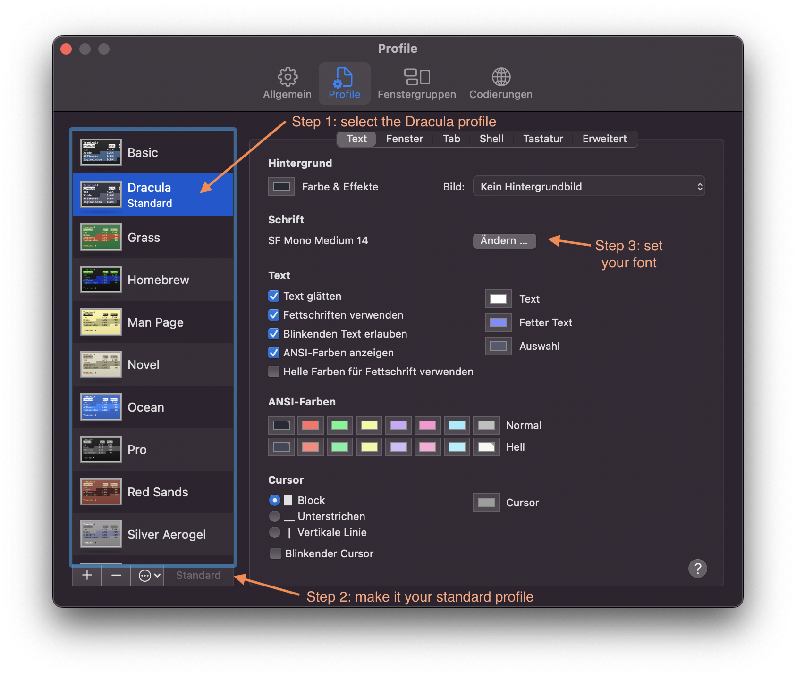

Dedicated to my fellow student Florian. 🖤

Today I will show you how I customized my Mac OS Terminal with a Dracula color scheme and oh-my-zsh.

# Oh my zsh
First, let's install oh-my-zsh. You can do this by pasting following command in your terminal.
If you want to find out more about oh-my-zsh, check out [their webpage](https://ohmyz.sh/).
``` sh -c "$(curl -fsSL https://raw.github.com/ohmyzsh/ohmyzsh/master/tools/install.sh)" ```

# Color theme
For the colors I used the Dracula color theme (see [https://draculatheme.com/terminal](https://draculatheme.com/terminal)).
Download the [zipfile](https://github.com/dracula/terminal-app/archive/master.zip) from the page, extract it and open the extracted directory in your Finder.
Then, open the *Dracula.terminal* file by pressing the Command-Key on your keyboard, right clicking the file and choosing *open*.
A security warning will show up, but you can just hit the *open* button.
After that, open your Terminal, then navigate in the Menu Bar to *Terminal* > *Preferences* > *Profiles*. 
Then on the left side, select the Dracula theme and make it your standard terminal profile. 



# Font
I also modified the font settings of the Dracula terminal profile a little bit as you can see below. 
- Font type: SF Mono 
- Font setting: Medium 
- Font size: 14

Now you can enjoy the new look of your Terminal!

